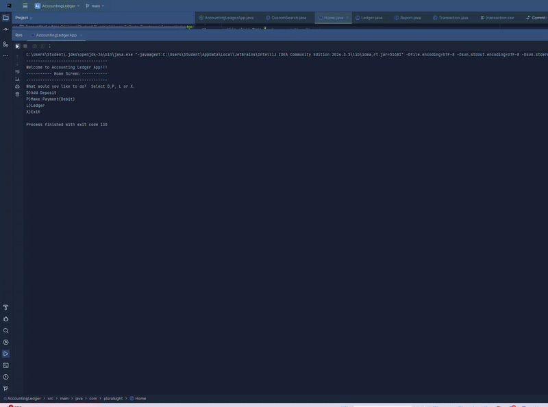
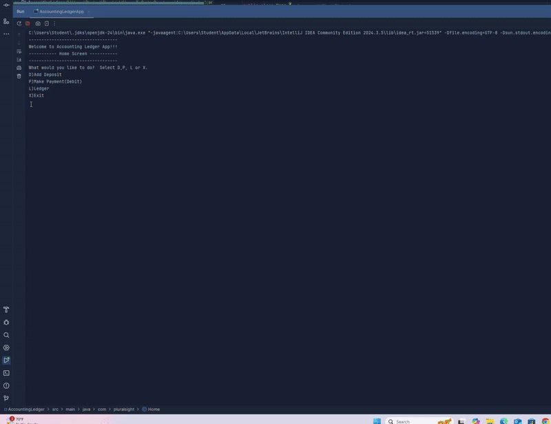
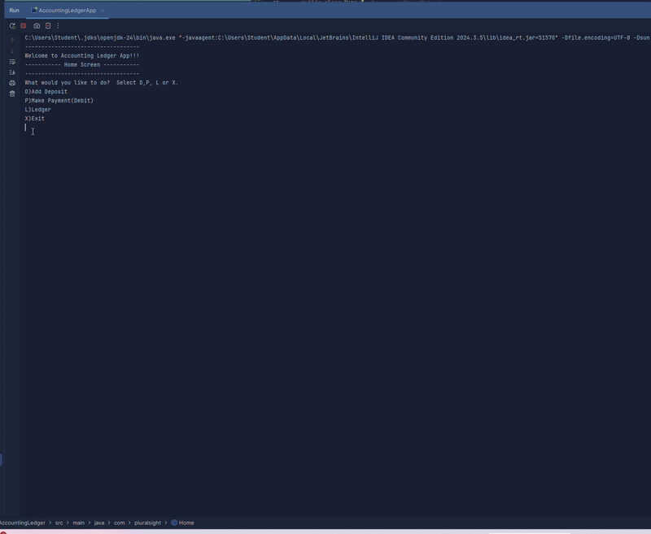

# Accounting-Ledger-App
## Description
The motivation behind this project was a class capstone assignment for Java Development Fundamentals.

I completed this project to see how much I have learned so far in building Java applications that handle user input and file storage.

By following the Acceptance Criteria,

I applied concepts like object instantiation, file writing and reading, data validation, and CLI (Command Line Interface) design.

My application allows users to track financial transactions like deposits and payments.

Each transaction is recorded into a transactions.csv file in the format: date|time|description|vendor|amount.

On the Home screen, the user can choose to add a deposit, make a payment, view the ledger, or exit the application.

The Ledger screen allows viewing all transactions, only deposits, only payments, and different types of reports like month-to-date, previous month, and search by vendor.

The program saves transactions right after the user inputs them and keeps running until the user chooses to exit.

## Table of Content
N/A

## Installation
N/A

## Usage
To use the application:

Open your Java IDE (like IntelliJ or Eclipse) or use the terminal/command prompt.

Navigate to the project folder.

Compile and run the AccountingLedgerApp Java file.

Follow the prompts shown in the console.

Example:

Choose D to add a new deposit.

Enter the required information (date, time, description, vendor, amount).

Choose P to record a payment.

Choose L to view ledger entries and reports.

Choose X to exit the application.

Every transaction will be saved automatically to the transactions.csv file located in /src/main/resources/.

## Screenshots
File Structure:


Home Screen:


Ledger Screen:


Reports Screen:



## Credit
Thanks to my instructor, tutor center support, my peers, lots of Googling, and AI assistance for helping me complete this project. Their support helped me figure out how to approach building the screens, handle file operations, and debug issues along the way.

## Interesting Piece of Code
One interesting part of my code was using validation as a method and passing the actual questions as an argument. It asks and also validates the answer.

java
Copy
Edit
 
//Usage of the Method validation
```
String description = validation("Enter the Description: \n");
String vendor = validation("Enter the Vendor: \n");
String amount = validation("Enter the Amount: \n");/

public static String validation(String ask) {
String answer = "";
while (true) {
System.out.print(ask);
answer = myScanner.nextLine().trim(); 
if (answer.isEmpty()) {
//if the users pass empty input, this will be displayed and continue asking the question.
System.out.println("Input cannot be empty. Please enter a valid response.");
} else {
break;
}
}
return answer;
/* method to validate if input to the questions is not valid for every question on the addDeposit method.
 return type string and parameter is the question I am asking at the addDeposit method.
 answer to the questions start with nothing
ask question to the user
take the input from the users about the deposit information store it a variable.
 it will return me the answer to the question after validating . make thing easier */
 
 ```

## License
N/A
